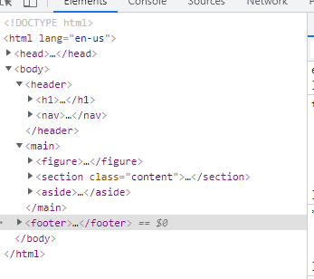
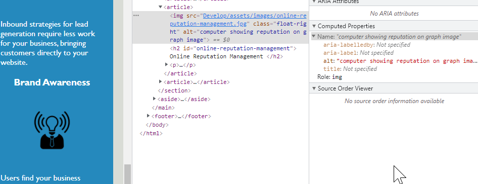
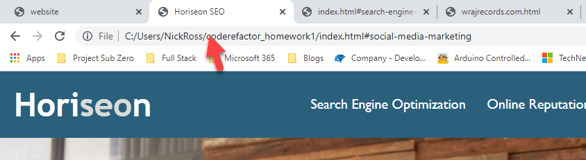

#Horiseon Redesign

Horiseon has requested an updated on their webpage so that it follows accessability standards. Chaning the webpage will optimatize it for search engines and drive new business. Here is the current webpage:

<a target="_blank" href="Assets\01-html-css-git-homework-demo.png">

<H2>Author</H2>
Nick Ross

<H2>Semantic Elements</H2>

The following shows the before and after of the changes to create semantic elements

Before:

After:

<H2>Logical Structure</H2>

The after picture shows a logical structure to the page

<H2>Alt attributes</H2>

Alt attribures have been added to every image

<H2>Heading And Title</H2>

Headings fall in a sequential order and the title is consise/descriptive

